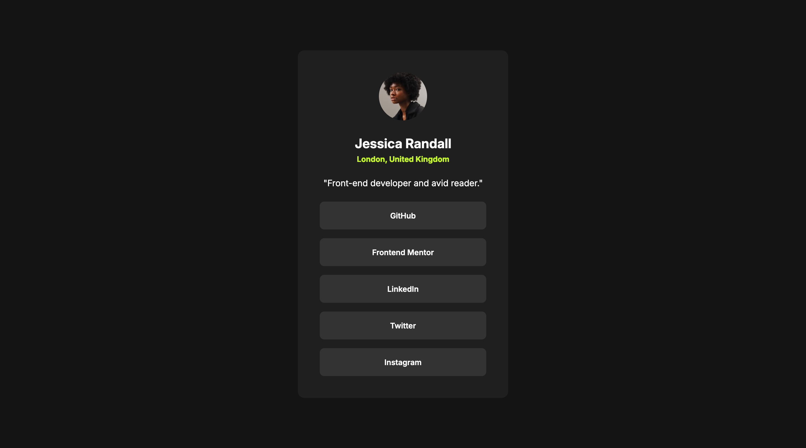
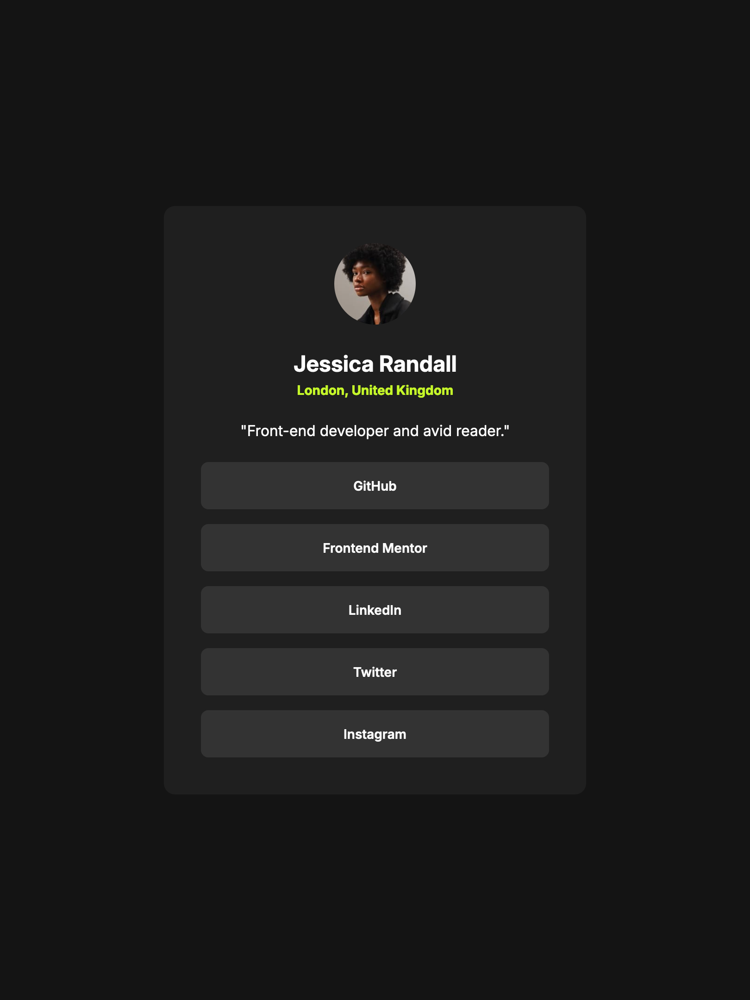
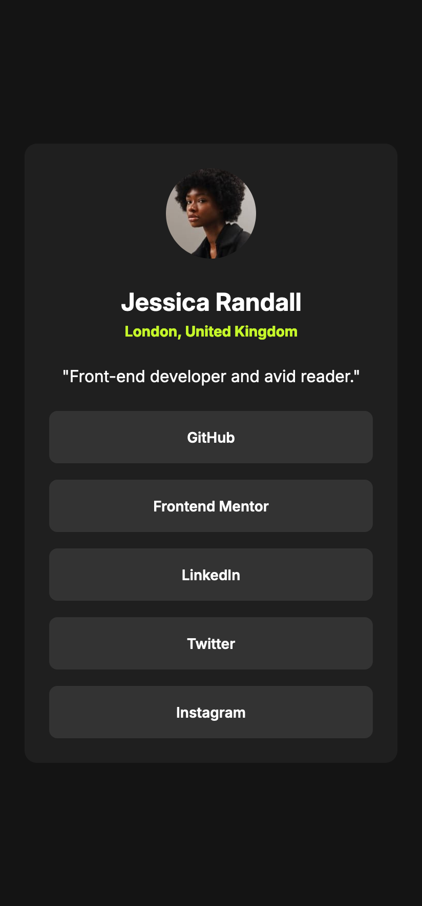

# Social Links Profile Challenge 👋

This is my solution to the Social links profile challenge on Frontend Mentor.

This is my solution to the Social Links Profile challenge from [Frontend Mentor](https://www.frontendmentor.io), where I implemented responsive design and interactive elements using HTML, CSS, GSAP (Animations).

## The challenge

Your users should be able to: 

- See hover and focus states for all interactive elements on the page

### Screenshot

**Thank you!** 🚀
